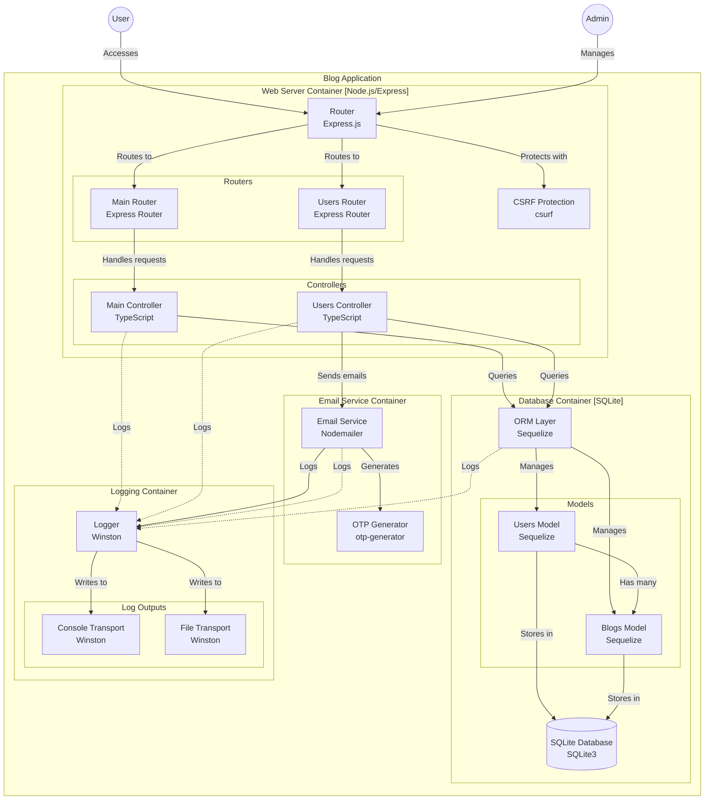
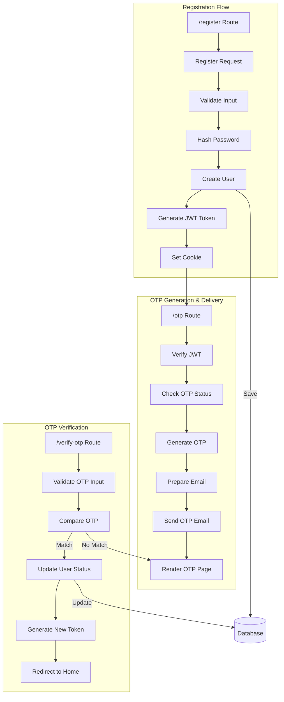

# blog-manu

To install dependencies:

```bash
bun install
```

To run:

```bash
bun run index.ts
```

# next update
1. trix editor https://github.com/basecamp/trix

This project was created using `bun init` in bun v1.1.42. [Bun](https://bun.sh) is a fast all-in-one JavaScript runtime.

# System Context

## I am working on a software system with the following directory structure, architecture, and analyzed files:

## Directory Structure
```
├── README.md
├── app
│   ├── controller
│   │   ├── mainController.ts
│   │   └── usersController.ts
│   ├── index.ts
│   └── router
│       ├── mainRouter.ts
│       └── usersRouter.ts
├── database
│   └── index.ts
├── index.ts
├── src
│   ├── nodemailer.ts
│   ├── types.d.ts
│   └── winston-log.ts
├── test
│   ├── datatest.test.ts
│   └── nodemailer.test.ts
└── types
    └── express-session.d.ts

```

## Mermaid Diagram


